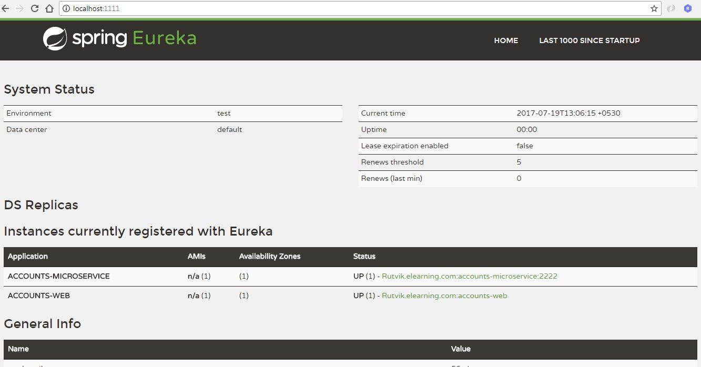

# discovery-microservice-server-master
> Day 1 - Spring Boot - Discovery Micro Service Server

### Description
This is a main discovery server where all microservcies are registerd.


## Screenshot



## To Create JAR

```sh
mvn clean package
```


## To Run JAR

```sh
java -jar target/com.rutvikpatel.ms.discovery-microservice-server-0.0.1-SNAPSHOT.jar
```


## Meta

Rutvik Patel - rrpatel003@gmail.com

Distributed under the GPL V3.0 license. See ``LICENSE`` for more information.
